# <div align="center">**Escuela Politécnica Nacional**</div>
### <div align = "center">***Facultad de Ingeniería en Sistemas***</div>
### <div align = "center">***Ingeniería en Ciencias de la Computación***</div>
### <div align = "center">***Programación II***</div>
### <div align = "center">***BIMESTRE II***</div>
<br>
<br>
<p align = "center">
</p>
</br>
</br>
</p>
</br>
</br>
</p>
</br>
</br>


----------------------------------------------------------------------------
## <div align = "center"> ===== ***TEMARIO II*** =====</div>
----------------------------------------------------------------------------

```Date: Martes 18 de junio```

# Clase 21

### Realizacion 

¿Seria posible plantear un escenario donde una clase hereda de mas de una clase (herencia multiple)?


- La herencia múltiple, de cara a la consistencia de los programas y los lenguajes tiene una relativamente alta complejidad.

- De ahí que algunos lenguajes orientados a objetos la permitan y otros no. 

- Java no permite la herencia múltiple, pero a cambio dispone de la construcción denominada “Interface” que permite una forma de simulación o implementación limitada de la herencia múltiple.


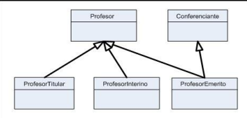


### Implementacion de Interfaces

- Interface construccion similar a clase abstracta en Java, diferencias: 

1. Encabezado 

- Se usa la **palabra clave ***interface***** en lugar de class o abstract class

***public interface INombreInterface {}***

2. **Todo metodo es abstracto y publico** sin necesidad de declararlo 

3. Las interfaces **no tienen constructor**

4. Una interfaz **solo admite campos/propiedades de tipo "public static final"** 

5. La **interface se implementa (implements), no se extiende (extends)** por sus subclases. Por tanto para declarar la herencia de una interface se usa la palabra clave ***implements*** en lugar de extends 


### Asociacion 

- Relaciones entre clases en un diagrama de clases UML

- Representado por una linea solida entre las clases 

- Las asociaciones se nombran usando un *verbo o frase verbal* que refleja el dominio del problema del mundo real 

#### Asociacion simple 

- Un vínculo estructural entre dos clases de pares

- Hay una asociación entre Class1 y Class2

- Hay una asociación que conecta la clase <<control>> Class1 y la clase <<boundary>> Class2

- La relación se muestra como una línea sólida que conecta las dos clases

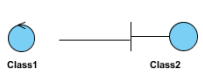

### Cardinalidad 

- Cantidad de elementos incluidos en la asociacion 

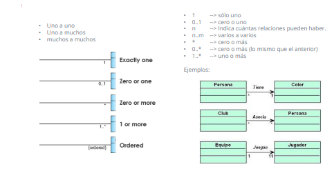

#### UML + Asociacion (cardinalidad : 0,1,+,*)

1. Bidireccional 

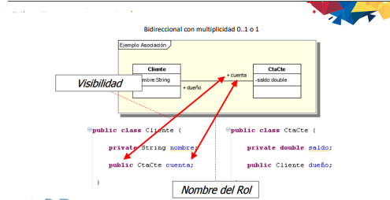

2. Direccional 

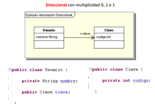

#### UML + Asociacion ( multiplicidad / cardinalidad : 0,1,+,0..*)

 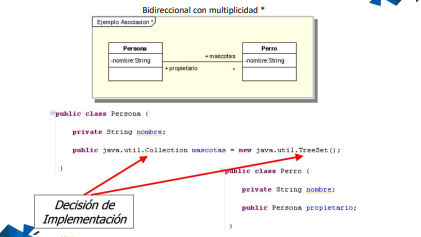

----------------------------------------------------------------------------   

```Date: Miercoles 19 de junio```

# Clase 22 

### ASOCIACION 

Se vio herencian. paqueteria, interfaces, comportamientos 

### Continuacion de la actividad 

La mision era realizar un diagrama de clases de la clasificacion de los animales vertebrados y realizar su respectivo codigo 

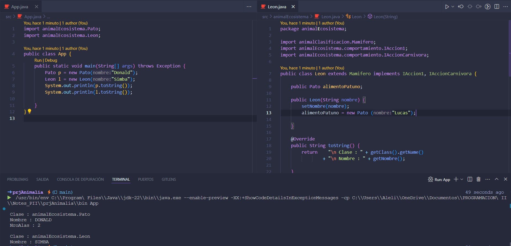

----------------------------------------------------------------------------   
  
```Date: Lunes 24 de junio```

# Clase 23

- La **herencia** en programación orientada a objetos permite que una clase (`subclase`) derive de otra (`superclase`), heredando sus atributos y métodos, lo que facilita la reutilización del código. 

- Una **interfaz** define un conjunto de métodos que una clase debe implementar, garantizando que las clases que la implementen proporcionen comportamientos específicos. 

- La **asociación** describe relaciones entre objetos de diferentes clases, permitiendo que un objeto contenga referencias a otros, facilitando la colaboración entre ellos. Estos conceptos ayudan a crear sistemas más organizados, flexibles y mantenibles.


Se continuo con el ejercicio que involucraba herencia, interface y asociacion:

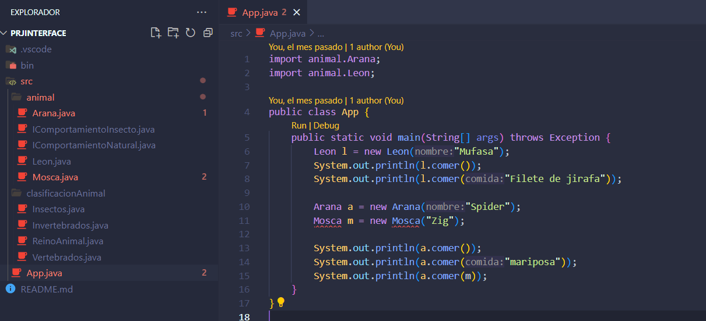

---------------------------------------------------------------------------- 

 
```Date: Lunes 1 de Julio```

# Clase 24

## Composicion 

### UML + Composicion 

- Hay una dependencia en los ciclos de vida 
- Son partes de (componentes)
- Costructor obligatorio de la clase 

    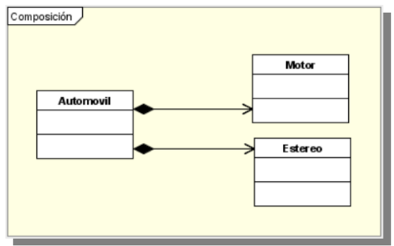


```java
public class Automovil {

    public Estereo estereo; 
    public Motor motor;
    
    public Automovil(); {
        estereo = new Estereo(); 
        motor = new Motor(); 
    }
}
```
### UML + Agregacion 

- Hay una dependencia en los ciclos de vida 

 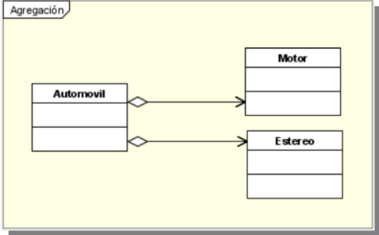


 ```java
public class Automovil {

    public Estereo estereo; 
    public Motor motor;
    
    public Automovil(); { 
    }

    public void ensamblar (Estereo e, Motor m){
        estereo = e; 
        motor = m; 
    }
}
```

### UML + Herencia

 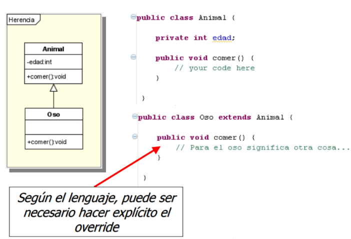

 - La interfaz hereda todas las operaciones de la interfaz extendida 

 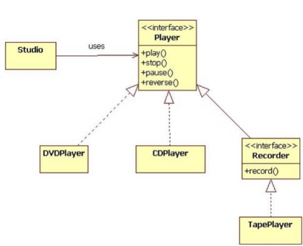


``` 
interface Player {
void play ();
void stop();
void pause ();
void reverse();
}

interface Recorder extends Player {
void record();
}

class TapePlayer implements Recorder {
public void play () { ... }
public void stop() { ... }
public void pause () { ... }
public void reverse() { ... }
public void record() { ... }
}
```

### UML + Interface 

1. 

 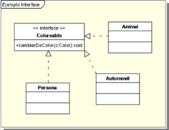

```java
public interface Coloreable {
    public void cambiarDeColor(Color c); 
}
```

```java
public class Automovil implements Coloreable {
    public void cambiarDeColor(Color c){
        // se debe implementar 
    }
}
```

2. 

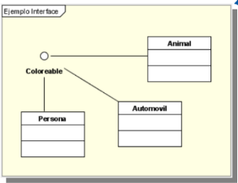 

```java
public class Persona implements Coloreable {
     public void cambiarDeColor(Color c) {
        // se debe implementar
     }
}
```

```java
public class Animal implements Coloreable {
    public void cambiarDeColor(Color c){
        // se debe implementar 
    }
}
```

### UML + Herencia Multiple 

- UML es una herramienta estandarizada y visual que facilita la representación de sistemas orientados a objetos mediante diversos diagramas. 

- Permite modelar estructuras complejas, incluyendo la herencia múltiple, que permite a una clase heredar de múltiples clases base. 

- Aunque la herencia múltiple promueve la reutilización de código, también introduce complejidad, la cual puede ser analizada y documentada eficazmente con UML.

    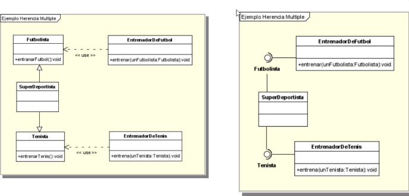

### UML + Herencia Multiple: Alternativa 

- Una alternativa para representar la herencia múltiple en UML es utilizar interfaces y asociaciones. 

- En lugar de heredar de múltiples clases, una clase puede implementar múltiples interfaces. Cada interfaz define un conjunto de métodos sin implementación, y la clase concreta proporciona las implementaciones necesarias.

- Esto ayuda a mantener la claridad y la simplicidad en los diagramas UML, evitando la complejidad y los problemas potenciales de la herencia múltiple.

    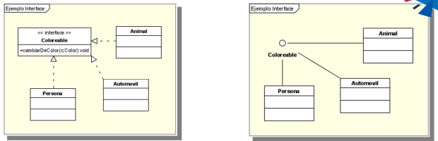

----------------------------------------------------------------------------  

```Date: Lunes 2 de Julio```

# Clase 25

## Agregacion 

- Relación "Parte-Todo": La agregación se utiliza para representar una relación "parte-todo" entre objetos. En esta relación, un objeto más grande (el contenedor o "todo") está compuesto por uno o más objetos más pequeños (las partes).

- Los objetos parte pueden existir independientemente del objeto contenedor. Esto significa que las partes no necesariamente deben ser destruidas cuando el contenedor es destruido. 


----------------------------------------------------------------------------  

```Date: Martes 3 de Julio```

# Clase 26

Ocupamos el pjrTuti para hacer cambios, se creando tres packages: 

1. EPN 

    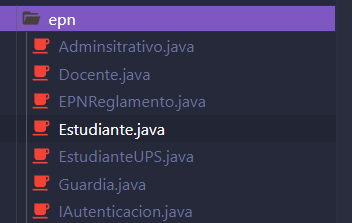

2. herenciaInterfaz

    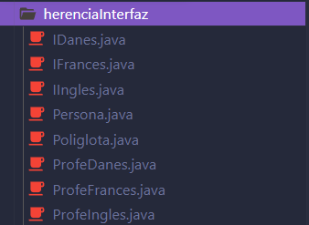

3. tuti 

    

De igual manera se crearon adicionalmente dos UML: 

El 01DiagramaCasoUso se creo anteriormente:  

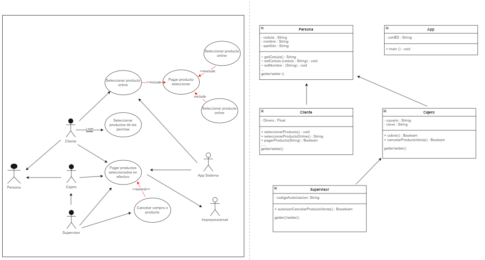

Adicional: 

02InterfazClases

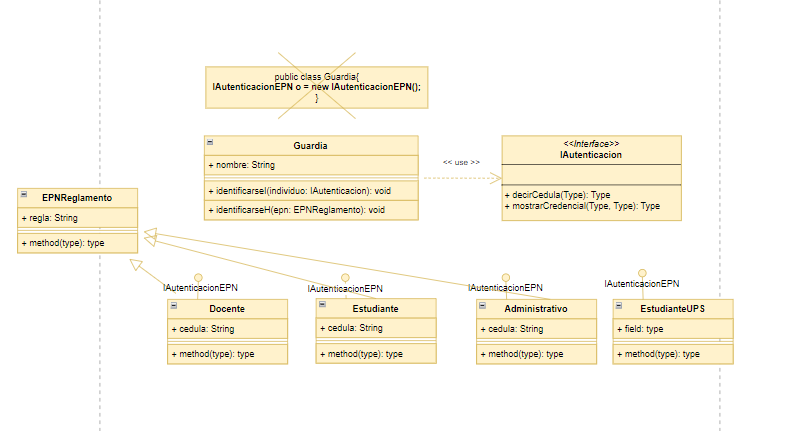

03HerenciaInterfaz

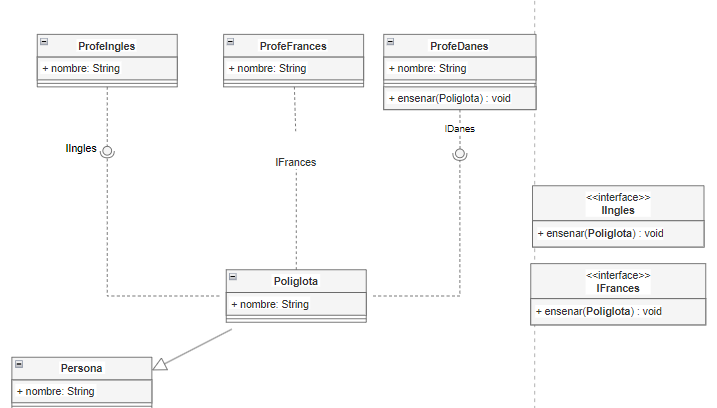

Ejecucion del codigo: 

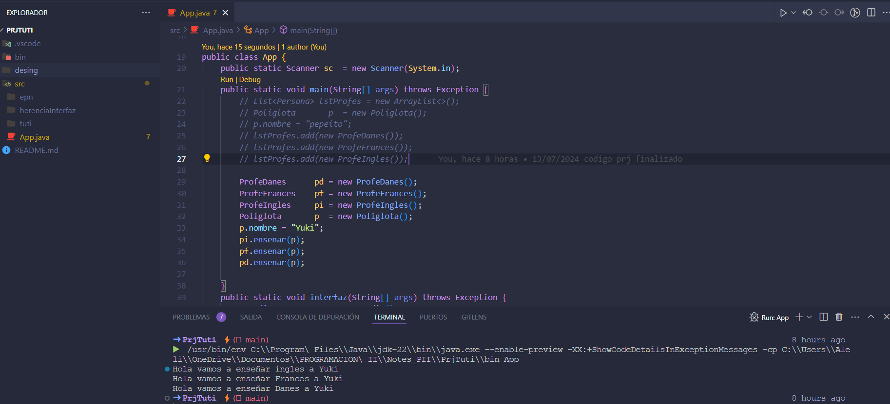


----------------------------------------------------------------------------  

```Date: Lunes 8 de Julio```

# Clase 28

Mision: Crear el escenario con prototipos tangibles 

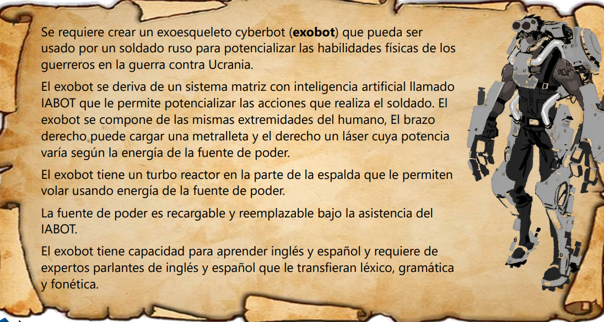

El prototipo fue el siguiente: 

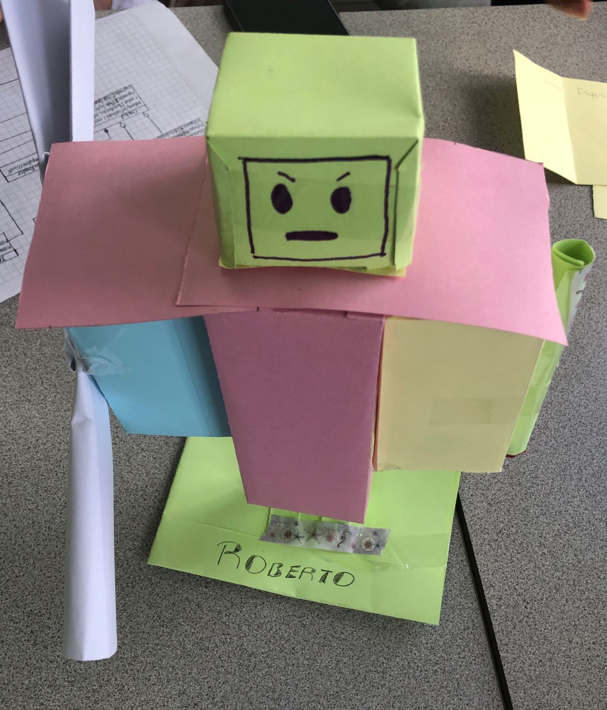

----------------------------------------------------------------------------  

```Date: Miercoles 10 de Julio```

# Clase 29

## Arq. General 

(Diagrama ExoBot)

## Arquitentura N-TIER 

La arquitectura N-TIER es un modelo de diseño de software que divide una aplicación en múltiples capas o niveles, cada uno con responsabilidades específicas. Generalmente incluye:

1. **Capa de Presentación**: Interfaz de usuario.

    - La interfaz es la cara de la aplicacion, donde la experiencia del usuario se moldea y existe interaccion 

2. **Capa de Aplicación**: Lógica de negocio.

    - Adquiere vida propia, las reglas empresariales, el flujo de procesos y calculos habitan aqui

    - La funcionalidad e inteligencia se unen para dar vida a la aplicacion 

3. **Capa de Datos**: Gestión de bases de datos.

    - La capa final se sumerge en la base de datos

    - Se obtienen, modifican y almacena datos

    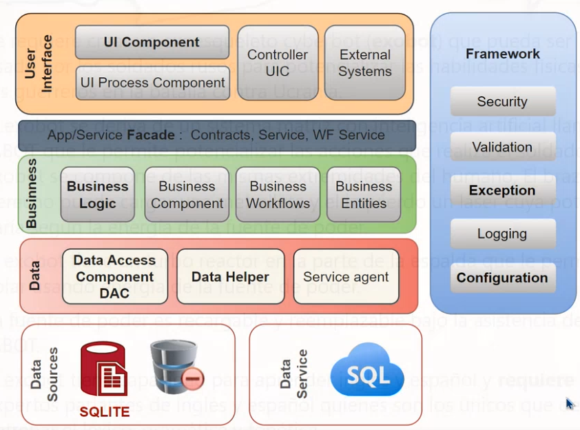


----------------------------------------------------------------------------  

```Date: Lunes 15 de Julio```

# Clase 30

- El Modelo Entidad-Relación (MER) es una herramienta fundamental en el diseño de bases de datos

- Representa la estructura lógica de una base de datos de manera visual mediante diagramas que ilustran las entidades y las relaciones entre ellas.

1. **Entidades**: Son objetos o conceptos del mundo real que tienen existencia propia y sobre los cuales se desea almacenar información, como `Cliente`, `Producto` o `Pedido`.

2. **Atributos**: Son las propiedades o características de las entidades, como `nombre`, `dirección` y `fecha` en una entidad `Cliente`.

3. **Relaciones**: Describen cómo las entidades están conectadas entre sí. Por ejemplo, una relación `Compra` podría conectar las entidades `Cliente` y `Producto`.


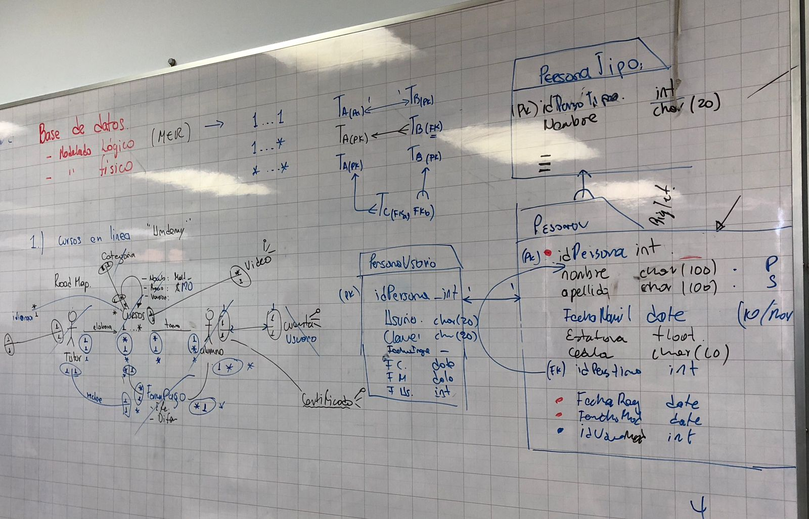 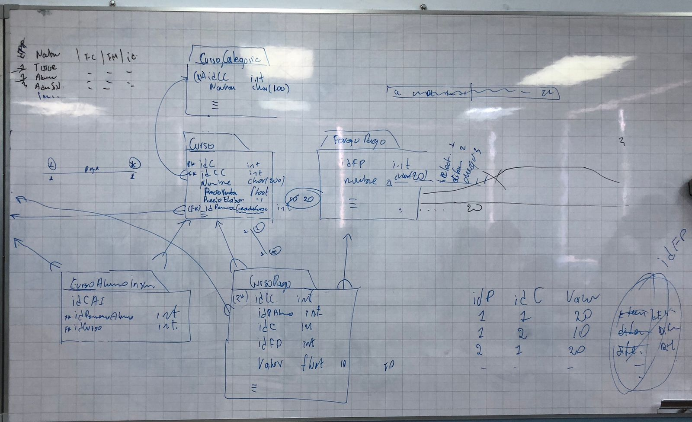

----------------------------------------------------------------------------  

```Date: Martes 16 de Julio```

# Clase 31

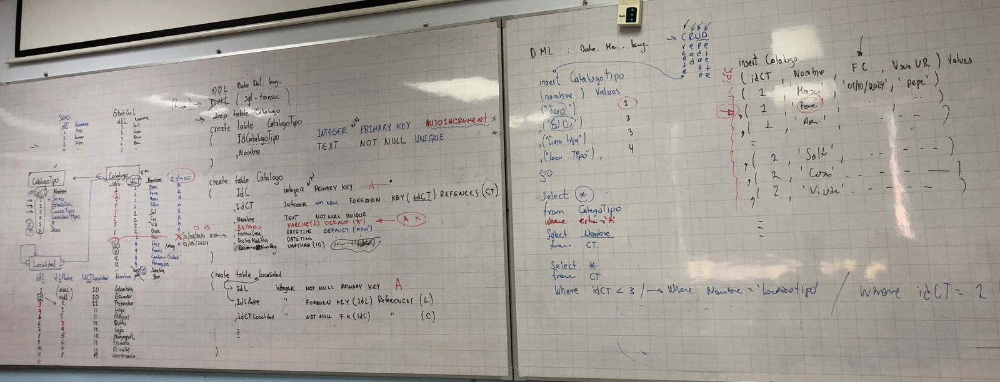


----------------------------------------------------------------------------  

```Date: Miercoles 17 de Julio```

# Clase 32

## SQLite 

- SQLite es un sistema de gestión de bases de datos relacional, autocontenido y ligero, que no requiere un servidor separado

- Almacena la base de datos en un único archivo y es muy utilizado en aplicaciones móviles, navegadores web y dispositivos integrados por su simplicidad y eficiencia

Adiconal se realizo un ejercicio de demostracion en vscode con las extensiones de SQLite 3 entre otros

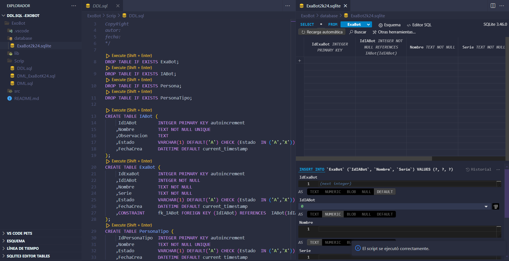

----------------------------------------------------------------------------  
----------------------------------------------------------------------------  

```Date: Lunes 22 de Julio```

# Clase 33

## Arquitectura N-Layer

- La arquitectura N-Layer es un modelo de diseño de software que organiza una aplicación en varias capas, cada una con responsabilidades específicas. 

- Capas mas comunes: 

1. **Capa de Presentación**:
   - **Función**: Maneja la interacción con el usuario. Presenta la interfaz gráfica y recibe las entradas del usuario.
   - **Componentes**: HTML, CSS, JavaScript, frameworks de UI como React o Angular.

2. **Capa de Lógica de Negocio**:
   - **Función**: Contiene la lógica de negocio de la aplicación. Procesa los datos entre la capa de presentación y la capa de datos.
   - **Componentes**: Lenguajes de programación como Java, C#, Python, reglas de negocio y validaciones.

3. **Capa de Acceso a Datos**:
   - **Función**: Gestiona la comunicación con la base de datos. Realiza operaciones CRUD (Crear, Leer, Actualizar, Eliminar).
   - **Componentes**: ORM (Object-Relational Mapping) como Hibernate o Entity Framework, consultas SQL.

4. **Capa de Datos**:
   - **Función**: Almacena los datos de la aplicación.
   - **Componentes**: Bases de datos relacionales (MySQL, PostgreSQL) o NoSQL (MongoDB).

5. **Capa de Servicios** (opcional):
   - **Función**: Facilita la integración y comunicación entre la aplicación y servicios externos.
   - **Componentes**: APIs RESTful, servicios SOAP.

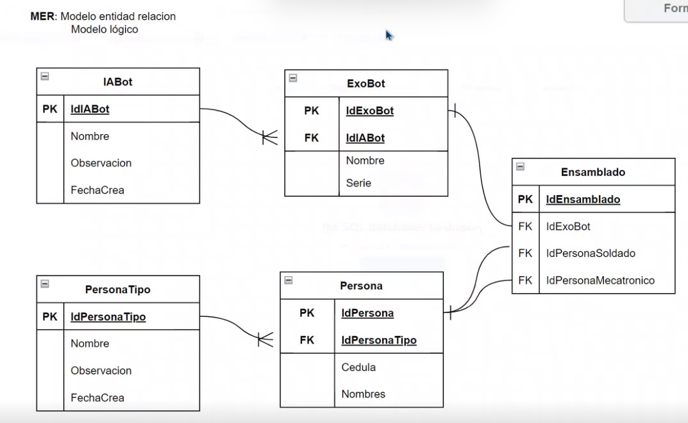

IGUALARSE EL CODIGO EXOBOT 

----------------------------------------------------------------------------  
----------------------------------------------------------------------------  

```Date: Martes 23 de Julio```

# Clase 34

## DAC + Data Base 

1. DAC:

Conexión a la Base de Datos: Establece y gestiona la conexión.
Consultas SQL: Ejecuta sentencias para interactuar con la base de datos.
ORM: Herramientas como Hibernate que mapean objetos a datos relacionales.

2. Base de Datos:

Tablas: Estructuras que almacenan datos.
Índices: Mejoran la velocidad de las consultas.
Procedimientos Almacenados: Programas que ejecutan lógica en la base de datos


IGUALARSE EL DESARROLLO 

----------------------------------------------------------------------------  
----------------------------------------------------------------------------  

```Date: Miercoles 24 de Julio```

# Clase 35

## Business Logic 

Relación entre "Business Logic" y "Business Logic Layer".

- Business Logic (Logica de Negocio) y Business Logic Layer (Capa de Logica de Negocio) estan estrechamente relacionados, pero no son exactamente lo mismo:

**1. Business Logic (Logica de Negocio):**

   - Es el conjunto de reglas, cálculos y procesos que definen como opera un negocio
   - Incluye las reglas, decisiones, cálculos y manipulaciones de datos específicos del negocio

**2. Business Logic Layer (Capa de Logica de Negocio):**

   - Es una capa en la arquitectura de software donde se implementa la logica de negocio
   - Forma parte de un diseño de software en capas, generalmente situandose entre la capa de presentacion y la capa de datos

**La diferencia principal es:**

- La logica de negocio es el concepto, las reglas y procesos en si
- La capa de logica de negocio es la implementacion estructurada de esa logica dentro de la arquitectura del software

**Beneficios de usar una Business Logic Layer:**

1. Separacion de responsabilidades
2. Reutilizacion de codigo
3. Mantenibilidad mejorada
4. Facilita las pruebas unitarias
5. Mejor escalabilidad

- Business Logic Layer es el lugar donde se implementa la Business Logic en una arquitectura de software en capas

----------------------------------------------------------------------------  
----------------------------------------------------------------------------  

```Date: Miercoles 31 de Julio```

# Clase 36

## GUI (Interfaz Grafica de Usuario)

**1. Elementos visuales:** Utiliza componentes graficos como botones, menus, ventanas, iconos y barras de herramientas.

**2. Interactividad:** Permite la interaccion directa del usuario mediante dispositivos de entrada como el ratón o la pantalla tactil.

**3. Retroalimentacion visual:** Proporciona respuestas visuales inmediatas a las acciones del usuario, como cambios de color o animaciones.

**4. Diseño intuitivo:** Organiza la informacion y controles de manera logica y facil de entender.

**5. Consistencia:** Mantiene un estilo y comportamiento uniforme en toda la interfaz.

**6. Accesibilidad:** Incluye características para usuarios con diferentes capacidades, como opciones de alto contraste o compatibilidad con lectores de pantalla.

**7. Personalizacion:** Permite a los usuarios ajustar ciertos aspectos de la interfaz segun sus preferencias.

**8. Múltiples ventanas:** Posibilita la gestion de varias ventanas o pantallas simultaneamente.

**9. Ayuda contextual:** Ofrece informacion de ayuda relacionada con la tarea o elemento actual.

**10. Representación visual de datos:** Utiliza graficos, diagramas y otros elementos visuales para presentar informacion compleja.

**11. Drag and drop:** Permite mover elementos en la interfaz mediante arrastre.

**12. Atajos de teclado:** Ofrece comandos rapidos para usuarios avanzados.

**13. Responsividad:** Se adapta a diferentes tamaños de pantalla y dispositivos.

**14. Gestion de errores:** Muestra mensajes de error claros y ofrece soluciones cuando es posible.

**15. Navegación clara:** Proporciona una estructura de navegación facil de entender y usar.


----------------------------------------------------------------------------  