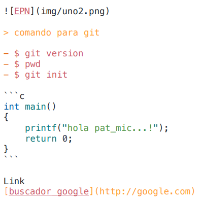
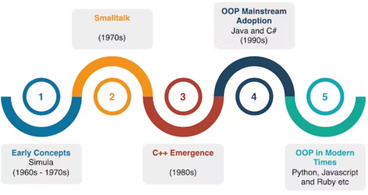
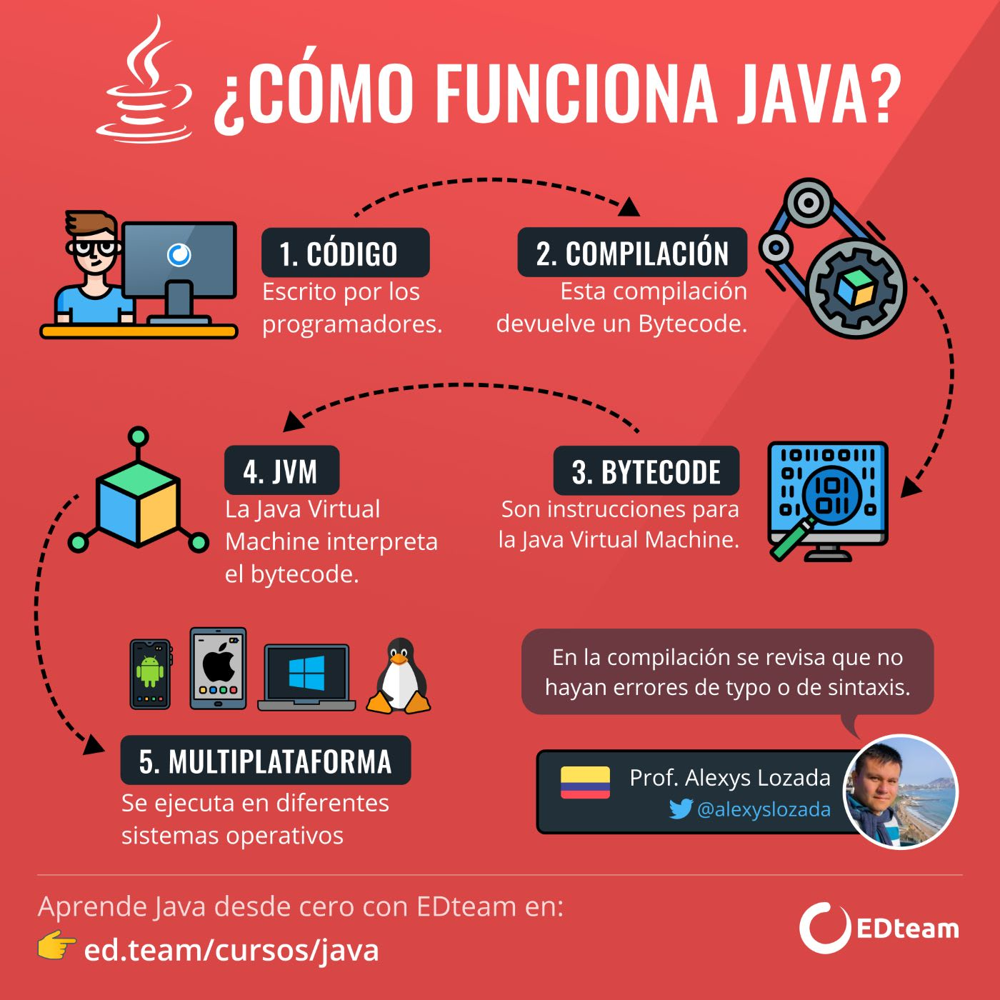

**ESCUELA POLITECNICA NACIONAL**
----------------------------------------------------------------------------
### *Facultad de Ingenieria en Sistemas/Computacion*

----------------------------------------------------------------------------
```Date: Lunes 29 de abril```

# Primera Clase

## Presentacion : Datos Generales 
Carrera : Ingenieria en software / computacion 

Asignatura : Programacion II

Tutor : Patricio Paccha | pat_mic

## Sistema de evaluacion 


## Contenido 
- Colaborativos 
- Flexibles 
- Honestos 
- Curiosos 
- Cultura organizacional 
- Normativa
- Codigo de etica 

## Recursos - TALLER MA01 
- Trabajo colaborativo 
- Material: fideos, marshmallows, cinta metrica, cinta adhesiva


```Date: Martes 30 de abril```

# Segunda Clase

## *Comandos Linux*

1. pwd : lugar actual

2. touch readme.md : crear archivos  

3. code readme.md : abrir archivos     

4. ls : listar archivos y carpetas 

5. cd : cambia directorio de trabajo 

6. mkdir : crea nuevo directorio
   
7. rm : elimina un archivo 

8. cp : copiar archivos-directorios (incluido contenido)

9. mv : mueve o renombra archivos-directorios

10. file : comprueba tipo archivo

11. ls-la : lista ocultar archivos y directorios

12. nano, vi y jed : edita un archivo con un editor de texto

13. cat : lista, combina y escribe contenido de un archivo 

14. sed : busca, sustituye o elimina patrones en un archivo 

15. sort : reordena el contenido de un archivo 

16. diff : compara el contenido de dos archivos 

17. locate : busca archivos en la base de datos de un sistema

18. find : muestra ubicacion de un archivo o carpeta 

19. useradd/userdel : crea y elimina cuenta de usuario

20. df : muestra uso general de espacio en disco 

21. du : comprueba consumo almacenamiento de archivo o directorio

22. scp : copia de forma segura archivos o directorios a otro sistema

23. man : muestra el manual de un comando 

24. echo : imprime un mensaje como salida estandar 

-------------------------------------------------------------------------

## *Comandos VSCode* 

1. Ctrl + Shif + P : abre paleta de comandos 

2. Ctrl + P : apertura rapida

3. Ctrl + B : abrir y cerrar el menu

4. Ctrl + D : cursor seleccion multiple

5. Shif + Alt + ⭡ / Shif + Alt + ⭣: copiar linea 

6. Shif + Alt + A (comentario varia lineas) | Ctrl + K + C (comentario una sola linea) : 
Bloque de codigo de comentario 

1. Alt + ⭠/⭢ : retroceder/avanzar 

2. Ctrl + T : mostrar todos los simbolos 

3. Ctrl + space | Ctrl + Shif + Space : sugerencia de activacion-parametros de activacion

4.  Ctrl + Shif + N : abre ventana nueva 
  
5.  Ctrl + Shif + W : cierra una ventana 

6.  Ctrl + C : copia fragmento de codigo 

7.  Ctrl + X : corta fragmento de codigo

8.  Ctrl + V : pega formato codigo copiado/cortado

9.  Ctrl + +/- : aumentar tamaño de letra/disminuir

10. Ctrl + O : abre explorador de archivos 

11. Ctrl + N : Crea un nuevo archivo 

12. Ctrl + S : Guarda 

13. Ctrl + F | Ctrl + H  : abre buscador | sustituir texto 

14. Ctrl + G : Desplazarnos a la linea que nos interesa
-------------------------------------------------------------------------
```Date: Miercoles 1 de mayo```

# Tercera Clase
## *Markdown* 

* Encabezados: 
# Titulo 1
## Titulo 2
### Titulo 3 
....
-------------------------------------------------------------------------
* Tipo de letra:
   - **palabras en negrita**
   - *palabras en cursiva*
   - ***palabras en negrita y cursiva***
   - ==texto resaltado==
   - ~~texto tachado~~
-------------------------------------------------------------------------
* Listas: 
  ##### Lista no ordenada:                    
  - Elemento 1
  - Elemento 2
  - Elemento 3 
   ##### Lista ordenada:
   1. Primer elemento 
   2. Segundo elemento 
   3. Tercer elemento
  
---------------------------------------------------------------
* Enlaces: 

 - [buscador google](http://google.com)

 - 

---------------------------------------------------------------
* Etiqueta: 
 
 <br>

 #### Codigo Java

 ```java
public class Hola {

  // Clase principal de la aplicacion 

  public static void main(String[] args) {
    System.out.println();
  }
}
```
-------------------------------------------------------------------------
* Tabla 

|Columna 1|Columna 2|
|--------|--------|
|    A    |    B    |
|    C    |    D    |

-------------------------------------------------------------------------
* Bloques de codigo: 
  - comillas invertidas ---> ´codigo en linea´
  - citas ---> crear citas utilizando el signo ">"
-------------------------------------------------------------------------
* Lineas horizontales: 
  - Guiones: ------
  - Asteriscos: *****
  - Guiones bajos: _____
-------------------------------------------------------------------------
## *GIT* 

*Comandos para el uso del GIT*

$ git --version 

```1. IDENTIDAD```

* $ git config --global user.name "yourname" 
* $ git config --global user.email "youremail@domain.com" 

```2. VERIFICAR```

* $ git config user.name  
* $ git config user.email

```3. INICIO CONTROL VERSIONES``` 

* $ git init   
* $ git status        
* $ git add . 
* $ git add NombreCarpeta/NombreArchivo.ext
* $ git commit -m "initial project version"
* git checkout -b (cambiarse de rama)

 ```4. INICIO CONTROL VERSIONES-CLONANDO```

* $ git clone https://github.com/xxyyy/abc
* $ git clone https://github.com/xxyyy/abc miPropioNombre

 ```5. QUITAR ARCHIVOS DEL CONTROL```

* $ echo ”nombreArchivo.ext” >> .gitignore
* $ echo ”*.txt” >> .gitignore

```6. VER ARCHIVOS IGNORADOS```

* $ cat .gitignore

```7. FORZAR AGREGAR ARCHIVO EXCLUIDO```

* $ git add -f NombreArchivo.log

-------------------------------------------------------------------------

```Date: Lunes 6 de mayo```

# Cuarta Clase
## *INTRO-POO*

#### ORIGEN JAVA


-------------------------------------------------------------------------
#### Objec-oriented Programming: A Primer

-------------------------------------------------------------------------
#### ¿COMO FUNCIONA JAVA?

(texto)

-------------------------------------------------------------------------

#### TIPOS DE LENGUAJE

-------------------------------------------------------------------------

#### SABORES DE JAVA 

-------------------------------------------------------------------------

#### SINTAXIS DE JAVA 

-------------------------------------------------------------------------

#### ESTRUTURAS vs O.O

*Programacion estructurada* 
- Funciones : 
- Procedimiento :

*Programacion Orientada Objetos* 

- Metodos : 

Diferencias entre P.E y P.O.O

1. P.E : 
* Strut 
* Variable 

*code:* 

include <iostream>
include <string>
strut Animal {
   int id;


}

-------------------------------------------------------------------------

1. P.O.O
* Clase
* Propiedad/Atributo
* Variables 

*code:* 

public class Aninal {


}

-------------------------------------------------------------------------

#### ALGORITMIA 


(TEXTO)


1. Pseudocodigo, diagrama flujo, trazabilidad

2. Detencion de errores

-------------------------------------------------------------------------

## CICLO FOR 